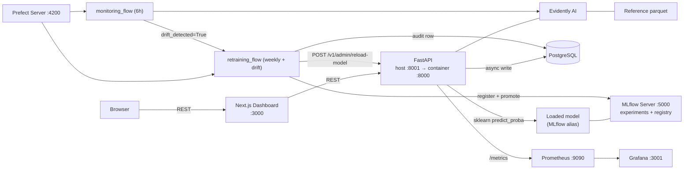

# FraudShield MLOps

> Production-grade fraud-detection MLOps platform with FastAPI, MLflow,
> Evidently AI, Prefect, Prometheus, Grafana, PostgreSQL, Docker, and
> Next.js — one command brings up the full closed-loop system locally.

[](https://github.com/sayujsawant-max/fraud-detection/actions/workflows/ci.yml)
[](https://github.com/sayujsawant-max/fraud-detection/actions/workflows/cd.yml)


---

## 1. Dashboard


> Capture this image once locally: run `make docker-up && make load-test`,
> open <http://localhost:3000>, and screenshot the Overview page. See
> [`docs/assets/README.md`](docs/assets/README.md) for the full
> screenshot brief.

## 2. Live demo

| Surface | URL | Status |
| --- | --- | --- |
| Frontend | `Coming soon` | Capture screenshot locally for now |
| API docs | `Coming soon` | <http://localhost:8001/docs> when running locally |
| Grafana | Local only | Screenshot demo — see `docs/demo-script.md` |
| MLflow | Local only | Screenshot demo — see `docs/demo-script.md` |

The Phase 10 deployment documentation in
[`docs/deployment.md`](docs/deployment.md) walks through the
free-tier Vercel + Render + Prefect Cloud setup that turns the local
demo into a public one.

## 3. What this project demonstrates

* **Production ML serving** — a real FastAPI endpoint scoring real
  sklearn pipelines under p99 < 50 ms.
* **Model registry** — MLflow registers every trained model, aliases
  the production version, archives old versions on promotion.
* **Experiment tracking** — three model families per training run, full
  PR-AUC / ROC-AUC / F1 / latency captured automatically.
* **Drift detection** — Evidently AI compares the live serving
  distribution against the training-time reference snapshot.
* **Automated retraining** — Prefect 3 flows on cron + drift-triggered,
  with champion/challenger comparison and hot-reload of the live API.
* **Observability** — Prometheus scrapes a custom `fraudshield_*`
  namespace; Grafana renders four auto-provisioned dashboards.
* **Audit logging** — every prediction lands in a Postgres table with
  the full input payload for forensic + drift purposes.
* **Premium dashboard UX** — six-page Next.js 14 App-Router dashboard
  consuming the typed FastAPI backend.
* **Dockerized infrastructure** — seven services with healthchecks
  and non-root runtimes, `make docker-up` to start.
* **CI/CD readiness** — GitHub Actions runs lint + tests + Docker
  builds + pre-commit on every PR. CD is wired up for Vercel + Render
  + GHCR but stays safe to merge until the deploy secrets exist.

## 4. Architecture overview


> Capture this image by exporting the Mermaid diagram from
> [`docs/assets/architecture-diagram.md`](docs/assets/architecture-diagram.md).
> The renderable source is below.



A walk-through of the full system — data flow, prediction flow, drift
flow, retraining flow, observability flow, DB schema — lives in
[`docs/architecture.md`](docs/architecture.md).

## 5. Tech stack

| Layer | Tool | Purpose |
| --- | --- | --- |
| API serving | **FastAPI** + Pydantic v2 + Uvicorn | Async REST API + OpenAPI docs + typed schemas |
| Frontend | **Next.js 14** + Tailwind + Recharts | App-Router dashboard with typed API client |
| Database | **PostgreSQL 16** + SQLAlchemy 2 + Alembic | Predictions, drift reports, retraining runs |
| Experiment tracking | **MLflow** | Runs + registry + alias-based champion promotion |
| Drift detection | **Evidently AI** | `DataDriftPreset` against the training reference |
| Orchestration | **Prefect 3** | `monitoring_flow` (6 h cron) + `retraining_flow` (weekly + drift-triggered) |
| Metrics | **Prometheus** + prometheus-client | 15 `fraudshield_*` collectors with bounded cardinality |
| Dashboards | **Grafana** | Four auto-provisioned dashboards in the `FraudShield` folder |
| Containers | **Docker Compose v2** | Seven services, healthchecks, named volumes |
| CI/CD | **GitHub Actions** | 4 parallel jobs on push + PR; CD safe-to-merge until secrets exist |
| Tests | **pytest** + httpx + aiosqlite | 220 tests / 76% coverage / no live infra needed |
| Lint + format | **ruff** | Single tool for lint + format, pinned to the pre-commit hook version |

## 6. Quick start

```bash
git clone https://github.com/<your-username>/fraud-detection.git
cd fraud-detection
cp .env.example .env

# Bring up the 7-service stack
make docker-up
make docker-ps                   # wait until everything is "healthy"

# Seed the system with realistic data
make generate-data               # train/test/reference parquet
make train-mlflow                # 3 model families, register champion
make promote-model VERSION=1     # flip the production alias
make db-upgrade                  # create the 3 audit tables
make seed-logs                   # 100 baseline predictions
make smoke-full                  # exercise every API endpoint
```

You're now ready to open the dashboard.

## 7. Service URLs

| Service | URL | Notes |
| --- | --- | --- |
| Frontend | <http://localhost:3000> | Next.js dashboard |
| FastAPI docs | <http://localhost:8001/docs> | Swagger UI |
| API health | <http://localhost:8001/health> | Liveness probe |
| MLflow | <http://localhost:5000> | Experiments + registry |
| Prefect | <http://localhost:4200> | Flow runs + deployments |
| Prometheus | <http://localhost:9090> | Scrape targets at `/targets` |
| Grafana | <http://localhost:3001> | admin / admin (local only) |
| PostgreSQL | `localhost:5432` | `${POSTGRES_USER}:${POSTGRES_PASSWORD}` from `.env` |

> The Grafana credentials are the local dev defaults. **Never** reuse
> them in production — see `.env.production.example`.

## 8. Demo flow

A reproducible 5-minute walkthrough lives in
[`docs/demo-script.md`](docs/demo-script.md). Short version:

1. Open the dashboard at <http://localhost:3000/>.
2. Click **Predict** → **Load High-Risk Fraud** → **Score transaction**.
3. Click **Logs** → top row → inspect the input-features JSON.
4. Run `make seed-drift` in a terminal.
5. Click **Monitoring** → **Run drift check**.
6. Click **Open HTML ↗** on the latest report.
7. Click **Settings** → enter API key → **Run Retraining Flow**.
8. Open MLflow → see the new run + champion alias.
9. Open Grafana → **FraudShield → Model Behavior**.

That covers every layer of the platform.

## 9. API examples

```bash
# Health
curl http://localhost:8001/health

# Predict
curl -X POST http://localhost:8001/v1/predict \
  -H "Content-Type: application/json" \
  -d @backend/scripts/sample_transaction.json

# Audit trail
curl http://localhost:8001/v1/logs | python -m json.tool

# Drift check
curl -X POST http://localhost:8001/v1/monitoring/drift/check \
  -H "Content-Type: application/json" \
  -d '{"limit": 1000, "save_report": true}'

# Admin: trigger retraining (API-key-protected)
curl -X POST http://localhost:8001/v1/admin/retrain \
  -H "X-API-Key: change-me" \
  -H "Content-Type: application/json" \
  -d '{"trigger_reason":"manual"}'
```

Full API reference: [`docs/api-reference.md`](docs/api-reference.md).

## 10. Testing

```bash
make test                # backend pytest with 65% coverage gate (currently 76%)
make lint                # ruff check + next lint
make format-check        # ruff format --check (CI style)
make smoke-full          # end-to-end probe of every API endpoint
make build-frontend      # cd frontend && npm run build
make precommit           # run every pre-commit hook against the worktree
make readiness-check     # Phase 10 — confirm the repo is publish-ready
```

The full Phase 9 gate runs in one shot:

```bash
make phase9-test
```

## 11. CI / CD

* **`.github/workflows/ci.yml`** runs on every PR + push to `main` /
  `develop`. Four parallel jobs:
  * `backend-lint-test` — ruff lint, ruff format check, pytest with
    `--cov-fail-under=65` (uploads coverage.xml).
  * `frontend-lint-build` — `npm ci` → `npm run lint` → `npm run build`.
  * `docker-build` — Buildx for both Dockerfiles (no push) with the
    `gha` cache to keep PR runs under five minutes.
  * `precommit` — `pre-commit run --all-files --show-diff-on-failure`.
* **`.github/workflows/cd.yml`** runs on push to `main`. Builds both
  images and pushes to `ghcr.io/<owner>/<repo>-{backend,frontend}`
  *only when* `secrets.GHCR_TOKEN` is set. The Render + Vercel deploy
  hook steps are conditional on their respective secrets too. This
  means CD is safe to merge today; Phase 10 turns it on by adding three
  GitHub repo secrets.

## 12. Deployment

Local Docker Compose is the recommended demo path. Seven public-cloud
options (A–G) — Vercel for the frontend, Render for the API + Postgres
+ MLflow, Prefect Cloud for orchestration, Grafana Cloud for
observability — are documented in [`docs/deployment.md`](docs/deployment.md)
with checklists and a $0/month cost estimate.

## 13. Interview guide

Twenty canonical questions an interviewer will actually ask, with the
answers that land well in five minutes. See
[`docs/interview-guide.md`](docs/interview-guide.md).

## 14. Screenshots

Drop these into `docs/assets/screenshots/` once the stack is running
locally — see [`docs/assets/README.md`](docs/assets/README.md) for the
capture guide.

| File | Captures |
| --- | --- |
| `dashboard-home.png` | Overview page with KPIs |
| `predict-page.png` | Predict page after scoring the high-risk fraud example |
| `monitoring-page.png` | Drift score gauge + reports table |
| `mlflow-runs.png` | MLflow experiment view with the champion ribbon |
| `grafana-dashboard.png` | Grafana FraudShield → Model Behavior |
| `prefect-flow.png` | Prefect UI showing the two deployments |
| `architecture.png` | Architecture diagram (exported from Mermaid) |

A 90-second `demo.gif` walkthrough lives in `docs/assets/gifs/`.

## 15. Documentation map

| Document | Purpose |
| --- | --- |
| [`docs/architecture.md`](docs/architecture.md) | System overview + Mermaid diagram + flows + schema |
| [`docs/deployment.md`](docs/deployment.md) | Seven deployment options (A–G) + production checklist |
| [`docs/api-reference.md`](docs/api-reference.md) | Endpoint catalogue + request/response examples |
| [`docs/interview-guide.md`](docs/interview-guide.md) | 20 canonical Q&A |
| [`docs/demo-script.md`](docs/demo-script.md) | 5-minute walkthrough script + screenshot list |
| [`docs/troubleshooting.md`](docs/troubleshooting.md) | 16 common failures + fixes |
| [`docs/future-improvements.md`](docs/future-improvements.md) | Roadmap (near / medium / advanced) |
| [`docs/phase-plan.md`](docs/phase-plan.md) | The 10-phase build log + status |
| [`FRAUDSHIELD_BLUEPRINT.md`](FRAUDSHIELD_BLUEPRINT.md) | Pre-implementation reference design |

## 16. Future improvements

Honest backlog grouped by horizon. Highlights:

* **Near-term:** per-prediction SHAP explanations, richer Recharts
  visualisations on the Overview page, Slack alerting on drift events,
  signed-token admin auth.
* **Medium-term:** Kaggle IEEE-CIS dataset integration, MLflow S3
  artifact storage, automated cloud deploys, model calibration.
* **Advanced:** Kubernetes Helm chart, Feast feature store, Kafka
  streaming ingestion, shadow + canary deployments, multi-model
  registry, RBAC dashboard.

Full list with rationale: [`docs/future-improvements.md`](docs/future-improvements.md).

## 17. Contributing

Bug reports → [`.github/ISSUE_TEMPLATE/bug_report.md`](.github/ISSUE_TEMPLATE/bug_report.md).
Feature requests → [`.github/ISSUE_TEMPLATE/feature_request.md`](.github/ISSUE_TEMPLATE/feature_request.md).
PRs → [`.github/pull_request_template.md`](.github/pull_request_template.md).

Before opening a PR:

```bash
make precommit
make phase9-test
make readiness-check
```

## 18. Project status

All ten phases complete — see [`docs/phase-plan.md`](docs/phase-plan.md).

* 220 tests passing at 76 % backend coverage.
* `npm run build` clean across 7 routes.
* `make smoke-full` exercises every API endpoint.
* `make readiness-check` verifies the repo is publish-ready.
* CI green on every PR; CD safe to merge.

## 19. License

[MIT](LICENSE). Use it however you like — credit appreciated but not
required.
