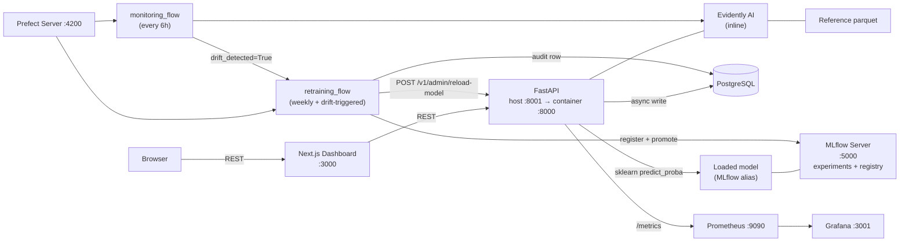

# Architecture

> **Status:** All ten phases complete. This document is the canonical
> description of how FraudShield MLOps fits together. The short version
> lives in [`FRAUDSHIELD_BLUEPRINT.md`](../FRAUDSHIELD_BLUEPRINT.md) §5.

## 1. System overview

FraudShield is a six-layer MLOps platform built around a single model
lifecycle (train → register → serve → log → monitor → retrain → reload).
Every layer is its own container in `infra/docker-compose.yml` so it can
be scaled, replaced, or moved to a separate cloud provider without
touching the others.

| Layer | Containers | Purpose |
| --- | --- | --- |
| **Data** | `postgres` | Synthetic dataset + audit storage (predictions, drift reports, retraining runs) |
| **Training** | (build-time) `make train-mlflow` | sklearn pipeline + MLflow experiment tracking + registry |
| **Serving** | `api` | FastAPI loads the production model from MLflow and scores transactions |
| **Monitoring** | `api` (Evidently inline) | Drift detection against the training reference snapshot |
| **Orchestration** | `prefect`, `prefect-flows` | Scheduled monitoring + automated retraining |
| **Observability** | `prometheus`, `grafana` | `fraudshield_*` metrics + four auto-provisioned dashboards |
| **Frontend** | `frontend` | Next.js 14 dashboard consuming the FastAPI backend |

## 2. Architecture diagram

A renderable Mermaid version lives at
[`docs/assets/architecture-diagram.md`](assets/architecture-diagram.md).
The diagram below mirrors that source.



## 3. Data flow

The synthetic dataset is generated by `backend/scripts/generate_data.py`
and split 80 / 20 into `data/raw/train.parquet` and `test.parquet`. The
first 5 000 rows of the training split become
`data/reference/reference.parquet` — that's the snapshot Evidently
compares against to decide whether the live traffic has drifted.

```
generate_data.py
    └── train.parquet           ───┐
        test.parquet            ───┤
        reference.parquet       ───┤
                                   ▼
                          train_with_mlflow.py
                                   │
                                   ▼
                              MLflow registry
                                   │
                                   ▼
                          FastAPI startup loads
                          models:/fraud-detector@production
                                   │
                                   ▼
                     POST /v1/predict — scored in <50 ms
```

## 4. Prediction flow

```
Browser → Next.js form → POST /v1/predict (FastAPI)
                                │
                                ├─► FraudPredictor.predict(payload)   (sync)
                                │     └─► sklearn Pipeline ─► proba
                                │
                                ├─► PredictionLogRepository.create_log()   (async)
                                │     └─► PostgreSQL prediction_logs
                                │
                                ├─► record_prediction()                    (sync, in-process)
                                │     └─► fraudshield_predictions_total / _score
                                │
                                └─► PredictionResponse JSON ─► Browser
```

The audit-log write is *best-effort* — if Postgres is down the
prediction still succeeds. That's the
[Phase 3 design rationale](../FRAUDSHIELD_BLUEPRINT.md) §9.

## 5. Drift detection flow

```
make seed-drift  (or live traffic)
    │
    ▼
prediction_logs grows past DRIFT_MIN_SAMPLES
    │
    ▼
POST /v1/monitoring/drift/check   (or monitoring_flow cron)
    │
    ├─► load_reference_dataset(REFERENCE_DATA_PATH)
    ├─► load_prediction_log_rows(limit=DRIFT_LOOKBACK_LIMIT)
    ├─► DriftDetector.run(reference, current)   (Evidently DataDriftPreset)
    ├─► extract_drift_metrics(snapshot)
    │     └─► drift_score, num_drifted_features, total_features
    ├─► DriftReportStore.save_html() / save_json()
    └─► DriftReportRepository.create_report()
              │
              ▼
        drift_reports row + HTML at /v1/monitoring/drift-reports/{id}/html
```

When `drift_score > DRIFT_THRESHOLD` (0.30 by default) the
`monitoring_flow` calls `retraining_flow(trigger_reason="drift")`.

## 6. Retraining flow

```
retraining_flow(trigger_reason)
    │
    ├─► log_retraining_start_task()             # status=running, INSERT row
    ├─► prepare_training_data_task()            # ensure parquet files exist
    ├─► train_challenger_model_task()           # XGBoost / RF / LR fallback
    │     ├─► MLflow run with metrics + artifacts
    │     └─► registry.register_model() + alias "champion"
    ├─► get_champion_metrics_task()             # read current production PR-AUC
    ├─► compare_challenger_to_champion_task()
    │     └─► should_promote = challenger_pr_auc - champion_pr_auc >= MODEL_PROMOTION_MIN_DELTA
    │
    ├─► [promote] promote_challenger_task()     # flip "production" alias + archive
    │            reload_api_model_task()        # POST /v1/admin/reload-model
    │
    └─► log_retraining_end_task()               # status=promoted | rejected | failed
                                                # + metrics + outcome_notes
```

If `champion_pr_auc is None` (first-ever model), the challenger is
auto-promoted with an explanatory note. If the comparison fails
(`challenger_pr_auc - champion_pr_auc < MODEL_PROMOTION_MIN_DELTA`),
the alias stays put and the run is recorded as `rejected`.

## 7. Observability flow

```
Every request through FastAPI
    │
    ▼
PrometheusMiddleware
    ├─► fraudshield_requests_total{method, endpoint, http_status}++
    ├─► fraudshield_request_duration_seconds_bucket{endpoint} observe(s)
    └─► fraudshield_requests_in_progress{endpoint} ++ / --

Domain code emits the model + drift + retraining counters via
record_prediction / record_batch / record_drift_check / record_retraining_run.

Prometheus scrapes /metrics every 15 s from api:8000.
Grafana reads Prometheus and renders:
    • FraudShield — API Performance
    • FraudShield — Model Behavior
    • FraudShield — Drift & Retraining
    • FraudShield — System Health
```

Cardinality is bounded by design — labels are limited to method, route
template, status code, predicted label, and trigger reason. No
per-transaction labels.

## 8. Database schema summary

Three tables, all migrated by Alembic (`make db-upgrade`).

| Table | Created by | Key columns | Purpose |
| --- | --- | --- | --- |
| `prediction_logs` | `phase_4_create_prediction_logs.py` | `id`, `transaction_id`, `timestamp`, `input_features` (JSONB), `fraud_probability`, `predicted_label`, `model_name`, `model_version`, `latency_ms` | Audit trail for every served prediction |
| `drift_reports` | `phase_5_create_drift_reports.py` | `id`, `report_id`, `generated_at`, `status`, `drift_detected`, `drift_score`, `num_drifted_features`, `report_html_path`, `triggered_retrain` | One row per Evidently drift run |
| `retraining_runs` | `phase_6_create_retraining_runs.py` | `id`, `trigger_reason`, `started_at`, `completed_at`, `status`, `challenger_pr_auc`, `champion_pr_auc`, `promoted`, `outcome_notes` | End-to-end retraining audit |

All three use a platform-aware UUID column type
(`PG_UUID` on Postgres, `CHAR(36)` on SQLite) so the same ORM models
power production and the SQLite-backed test suite.

## 9. Service responsibilities

| Service | Owns | Talks to |
| --- | --- | --- |
| `postgres` | Audit tables, MLflow backend store | api, mlflow, prefect-flows |
| `mlflow` | Experiments, model registry, artifacts | postgres, api, prefect-flows |
| `api` | Predictions, log writes, drift compute, Prometheus metrics emit | postgres, mlflow |
| `prefect` | Flow registry + UI + scheduler | (passive, called by `prefect-flows`) |
| `prefect-flows` | Long-running `flow.serve()` for monitoring + retraining | api, postgres, mlflow, prefect |
| `prometheus` | Scrape `api:8000/metrics` every 15 s | api |
| `grafana` | Auto-provisioned dashboards + datasource | prometheus |
| `frontend` | Dashboard UI | api |

## 10. Why each tool

* **FastAPI** — async-native, OpenAPI documentation built in, Pydantic v2
  validation. Cuts the boilerplate that a Flask + Marshmallow stack
  would require.
* **MLflow** — free, self-hostable, talks SQL natively, the de facto
  registry for sklearn pipelines, and integrates with every cloud.
* **Evidently AI** — the only OSS drift library that ships out-of-the-box
  presets for the share-of-drifted-columns metric the blueprint cares
  about; saves an HTML report we can link straight into the dashboard.
* **Prefect 3** — Python-native flow definitions, free open-source server,
  works with `flow.serve()` for local cron without needing a worker pool.
* **Prometheus + Grafana** — the production observability standard; every
  serious deployment target already speaks it.
* **PostgreSQL 16 + SQLAlchemy 2.0 + Alembic** — proven RDBMS, async
  ORM, scriptable migrations.
* **Next.js 14 + Tailwind + Recharts** — App-Router SSR, dark theme out of
  the box, zero-config chart library that handles our data sizes.
* **Docker Compose** — production-equivalent topology in one file; the
  Kubernetes migration is mechanical (see `docs/interview-guide.md` §18).

## 11. Production considerations

* **Model loading.** `load_model_safely()` never raises at startup so a
  broken MLflow doesn't crash the API; `/ready` flips to 503 instead.
* **Database failure mode.** Prediction logging is async and best-effort
  — a Postgres outage doesn't take `/v1/predict` down. The drift +
  retraining endpoints do require Postgres, and respond with 503 if it's
  gone.
* **Secrets.** Every credential is environment-driven; the `.env*` files
  are git-ignored, and `.env.example` / `.env.production.example` ship
  safe placeholders only.
* **Schemas.** Pydantic v2 strict mode rejects unknown fields, and the
  Literal-typed merchant / card / device / browser fields are derived
  from the training-time vocabulary in `features/constants.py`.
* **Healthchecks.** Every Compose service has one, with `start_period`
  tuned per service so the stack ascends in dependency order.
* **CI.** `.github/workflows/ci.yml` runs ruff lint, ruff format-check,
  pytest with `--cov-fail-under=65`, Next.js lint + build, both Docker
  images, and all pre-commit hooks in four parallel jobs.

## 12. Known limitations

* **Single-model registry.** The retraining flow trains one challenger
  per run and either promotes it or rejects it. There's no shadow
  deployment or champion/challenger A/B test in production traffic.
* **Synthetic data.** The dataset is generated, not real Kaggle
  IEEE-CIS. The pipeline is real; the labels are toy.
* **No explainability surface.** Per-prediction SHAP / LIME is not
  computed or returned by `/v1/predict`. The Phase 8 dashboard would
  benefit from that.
* **No alerting.** Prometheus exposes the data; Slack / PagerDuty
  routing is out of scope (tracked in
  [`docs/future-improvements.md`](future-improvements.md)).
* **No user accounts.** The admin API key is the only auth surface.
  Real-user RBAC is intentionally out of scope.

See [`docs/future-improvements.md`](future-improvements.md) for the
roadmap of each of these.
