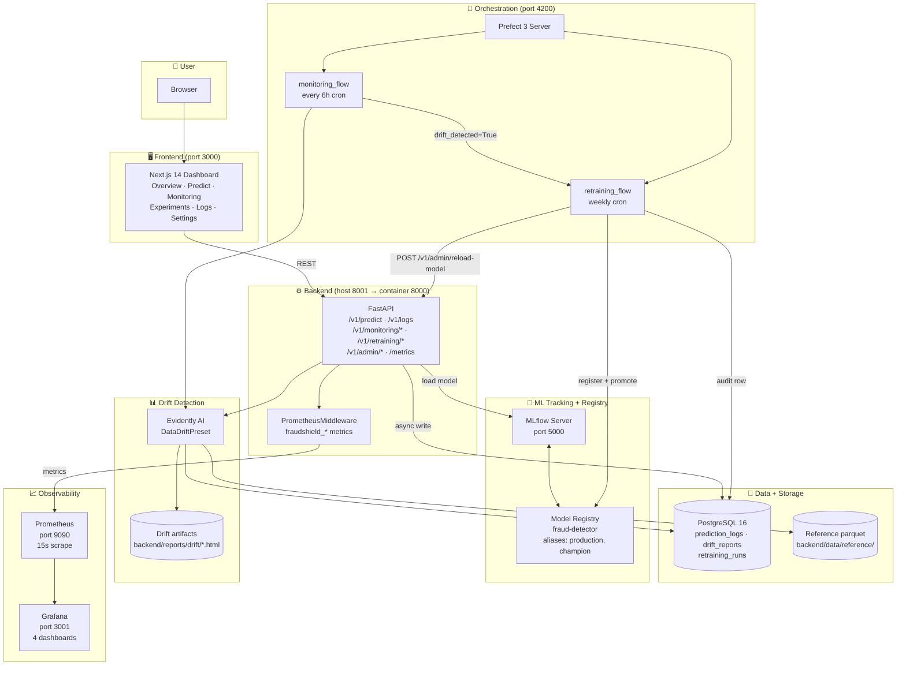

# Architecture diagram (Mermaid)

This file is the canonical source for the FraudShield architecture
diagram. Render it inline on GitHub, or export to PNG and drop the result
at `docs/assets/screenshots/architecture.png` for the README hero.

## Render



## Quick-export to PNG

Mermaid Live (no install required):

1. Open <https://mermaid.live>
2. Paste the diagram source (from the code fence above)
3. Use the **Actions → PNG** button
4. Save as `docs/assets/screenshots/architecture.png`

Or from the CLI with `@mermaid-js/mermaid-cli`:

```bash
npx -y @mermaid-js/mermaid-cli -i docs/assets/architecture-diagram.md \
  -o docs/assets/screenshots/architecture.png -b transparent -w 1600
```
